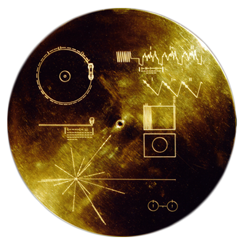
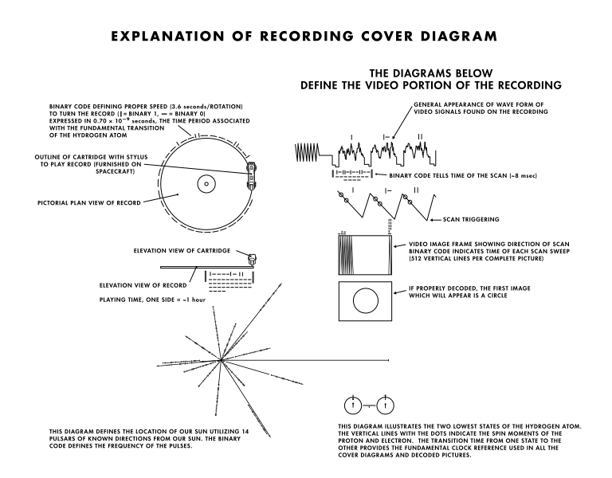
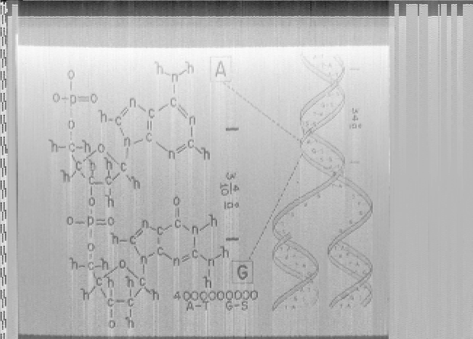
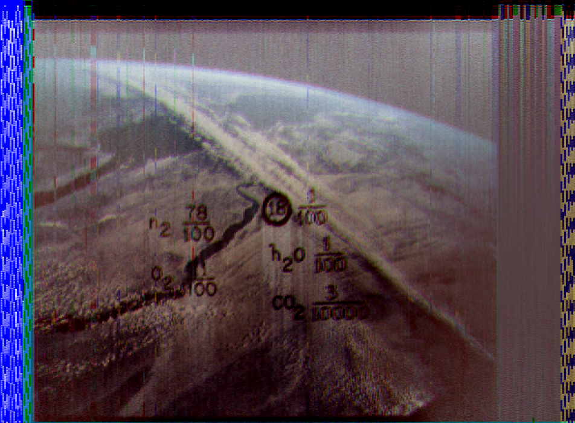

# Decoding Voyager's Golden Record



In the event that an intelligent extraterrestrial being ever comes across either of the two [Voyager](https://voyager.jpl.nasa.gov/) probes, they'll be able to get a good idea about humanity by the data stored in an enclosed time-capsule-like [golden record](https://en.wikipedia.org/wiki/Voyager_Golden_Record).  Above is a depiction of the engraved case containing each of these golden records.  These engravings explain how the record's data can be accessed.



One side of the record contains [audio recordings](https://ozmarecords.com/pages/voyager) that include greetings in multiple languages as well as sounds and music from around the world.  The other side of this record, however, contains a series of 115 images compiled by [Carl Sagan](https://en.wikipedia.org/wiki/Carl_Sagan).  These images are stored as audio split across both left and right stereo channels.  Using the instructions engraved on the record's cover, Voyager's encoded images can be visualized using Python!



Above is an example of the image data contained on the record.  These images span a range of subject matter including the natural, cultural, and scientific.  Although the [original images](https://voyager.jpl.nasa.gov/golden-record/whats-on-the-record/images/) are available online, there is something special about extracting them from the record's signal.



The code provided here takes a user specified WAV file containing images encoded in the same manner as those found on the Voyager space probe's golden record and outputs each of these images as separate grayscale PNG files.  Images that come in sets of 3 are in color and represent blue, green, and red channels in order.  All graphics extracted from the golden record's data (including color images like the one seen above) have been included here in the *extracted* folder.

## Dependencies

For this code to successfully run, it must be provided with an audio file containing images encoded in the same manner as those found on the Voyager space probe's golden record.  For reference, an archival copy of the golden record's encoded images has been provided as a [WAV (160MB)](https://drive.google.com/uc?export=download&id=11C4H4xGmz6vTrrJKVVR6urvxhrzUfC5I).

  * [PeakUtils](https://peakutils.readthedocs.io/en/latest/)
  * [matplotlib](https://matplotlib.org/)
  * [scipy](https://www.scipy.org/)
  * [numpy](http://www.numpy.org/)

You can use [pip](https://pypi.python.org/pypi/pip) to install any missing dependencies.

## Basic Usage

The decoding script contains several user-editable variables that should be changed for fine tuning.  The script is executed by running:

```
python voyager_decode.py
```

Included color images were processed by hand.

## Future Directions

Peak detection will be refined to fix line offset artifacts that are visible in some extracted images.  Additionally, a tool to encode user images as audio will be added.

## Acknowledgements

This project was inspired by [foodini](https://github.com/foodini/voyager)'s decoder writtern in C++.
